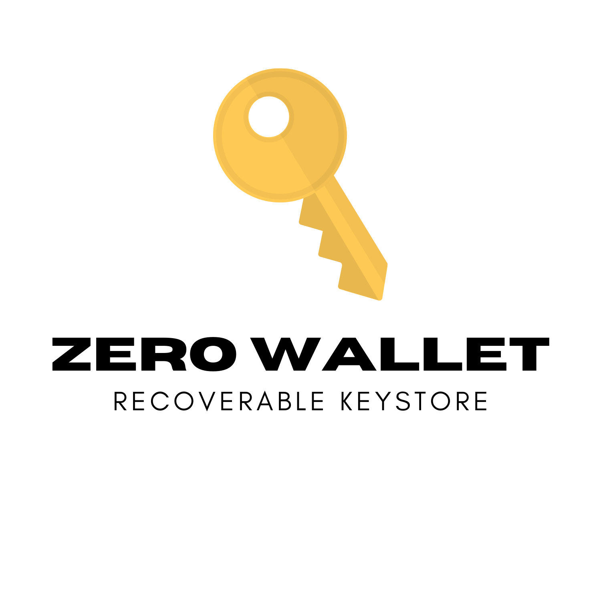

# Introduction
This is the repository for the core Morpher Wallet components of https://wallet.morpher.com

A wallet which needs zero installation and zero configuration.

  

# Prerequisites
* Install Docker https://docs.docker.com/get-docker/ and configure it correctly.
* Install Postgres https://www.postgresql.org/download/ (optional if you work with Docker).
* Install Node.js and Npm https://nodejs.org/en/download/ (optional if you work with Docker).
* Git clone this repo and `cd` into it.

# Installation
You can deploy Zerowallet on your local/cloud machine for testing in two ways: 

* You can deploy using Docker.

* You can setup a Postgres database, install Node.js and Npm.

###Setting up the wallet with Docker 
* Run `docker compose up --build` in this root repository.

Postgres database, backend and frontend will be automatically setup through the Docker scripts.  

Postgres database will be deployed at: `http://127.0.0.1:5432`.

Backend will be deployed at: `http://127.0.0.1:8080`.

Frontend will be deployed at: `http://127.0.0.1:3001`.

### Setting up the wallet with Node.js and Npm

#####Setting up backend
 
* Run `npm install` in the `backend-node` directory.

* Rename the `.env.example.` to `.env`.

* Input the correct database `DB_` variables.

* Run `npm run start`.

* Run `npm run db:seed` to populate the database with the initial data.
 
 Backend will be deployed at: `http://127.0.0.1:8080`.

#####Setting up frontend

* Run `npm install` in the `vue` directory. 
* Run `npm run serve` to start the frontend process.

 Frontend will be deployed at: `http://127.0.0.1:3001`.

# More information

Please take a look into the `docs` folder in this repository for some extra documentation and frequently asked questions.