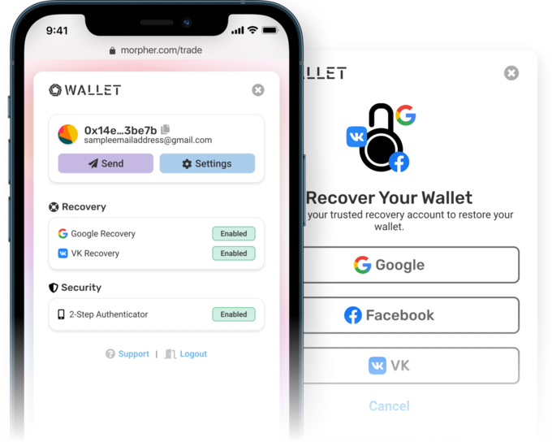

# Introduction

This is the repository for the core components of Morpher Wallet. Instead of being a full-blown wallet, it's a keystore that can be integrated in virtually any DApp which needs zero installation and zero configuration.

- [Try Morpher Wallet in your browser](https://wallet.morpher.com)
- [Use it on the Morpher App](https://www.morpher.com/trade)
- [Wallet Homepage](https://www.morpher.com/wallet)

   

---



The wallet users (probably) won't lose.

- Non-custodial, users own their keys
- Easy email/password sign up & log in flow
- Trusted recovery, restore wallet using Google/FB/VK account
- 2-Step verification with authenticator app or email
- Web-based (runs virtually anywhere)
- Full Web3 support (generate addresses, sign & send transactions)
- Hosted and self-hosted solutions
- Deep code-level customization with custom events and callbacks
- Secure: keystore encrypted at rest and during transmission
- Export seed or private key anytime to change wallets

# 🧰 Integrate into your DApp

The wallet has an SDK: a web3 object you can import into any JS app. But in its current form it was only designed to work really well with the Morpher trading app. We built this wallet to solve the problems our users were facing every day with other wallet providers ([see our post on crypto wallet pitfalls](https://www.morpher.com/blog/why-we-built-morpher-wallet)). Just like with our DApp, we want developers to have an invisible wallet that users don't need to notice or learn about.

Want to us to build a plug-and-play hosted solution for all DApp developers? Fill out the form below:

- **[SDK Request Form](https://docs.google.com/forms/d/e/1FAIpQLSdh00G9PenekJDMQoc4Nu8bYOpDFPULs0f04yuRpriTqnhrmg/viewform?usp=sf_link)**

# Documentation

- [Wallet Architecture and Technical Breakdown](docs/audit-doc.pdf)
- [Backend Request Signing](docs/requestsigning.md)
- [External Packages & Frameworks](docs/packages.md)
- [Other docs](docs/)

# Audit

Morpher Wallet is fully audited.

- Audited by Cryptonics on February 24, 2021. [Full Report](<docs/Audit Report - Morpher Wallet [20210224].pdf>)

Discovered a security issue? Please report it through our [Bug Bounty Program](https://www.morpher.com/bug-bounty).

# Building Locally

## Prerequisites Quickstart

- Install Docker https://docs.docker.com/get-docker/ and configure it correctly.
- [optional] Install Postgres https://www.postgresql.org/download/ (optional if you work with Docker).
- [optional] Install Node.js and Npm https://nodejs.org/en/download/ (optional if you work with Docker).
- Git clone this repo and `cd` into it.

  ```
  git clone https://github.com/Morpher-io/MorpherWallet.git
  cd MorpherWallet
  ```

## Installation

You can deploy MorpherWallet on your local/cloud machine for testing in two ways:

1. You can deploy using Docker (very quick).
2. You can setup a Postgres database, install Node.js and Npm and run every component separately.

### Setting up the wallet with Docker (quickstart)

Run `docker compose up`.

- Postgres database, backend and frontend will be automatically setup through the Docker scripts.
- Postgres database will be deployed at: `http://127.0.0.1:5432`.
  - User "postgres", password "example", db "zerowallet"
- Backend will be deployed at: `http://127.0.0.1:8080`.
- Frontend will be deployed at: `http://127.0.0.1:3001`.

### Setting up the wallet with Node.js and Npm

#### Setting up backend

- Run `npm install` in the `backend-node` directory.
- Rename the `.env.example.` to `.env`.
- Input the correct database `DB_` variables.
- Run `npm run start`.
- Run `npm run db:seed` to populate the database with the initial data.
- Backend will be deployed at: `http://127.0.0.1:8080`.

#### Setting up frontend

- Run `npm install` in the `vue` directory.
- Run `npm run serve` to start the frontend process.
- Frontend will be deployed at: `http://127.0.0.1:3001`.
