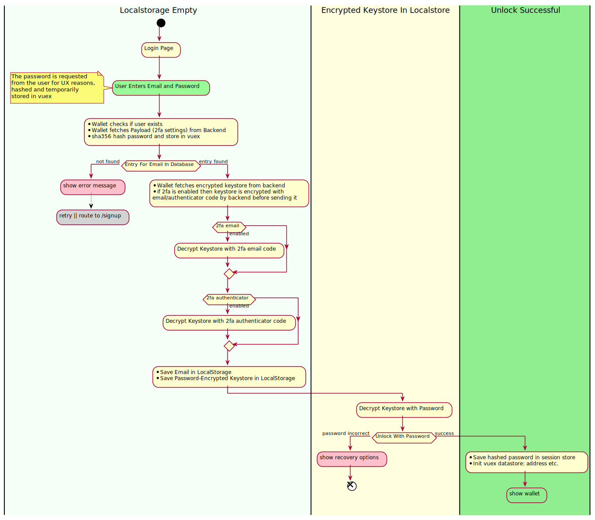

# Login Flow for the Wallet

When the user logs into the wallet the first time, then the browsers localstore and sessionstore is empty.

1. The user is required to enter Email-Address and Password.

    The password is temporarily stored, because of UX reasons. It is used later in the process.

2. The Wallet checks with the backend if the user already exists. 

    _Sidenote_: It became "good behavior" to show generic error messages to avoid leaking user-exists information. This simply doesn't make sense, because the backend is a data-store for an encrypted wallet. The actual decryption process is done in-browser.

3. Depending on the 2FA settings, the user is then required to enter the 2FA codes. The backend encrypts the wallet with the 2fa codes and only the correct codes + password can decrypt the keystore.

4. If decryption with 2FA and password was successful then the _password-encrypted_ keystore (after decrypt with 2fa) is stored in localstorage. This lets the user "unlock" the keystore with the password only in sub-sequent uses of the wallet

5. The wallet is initialized: The keystore is used to generate an account. The account is stored in the JavaScript-Storage-Backend. The frontend shows the Address and UI
