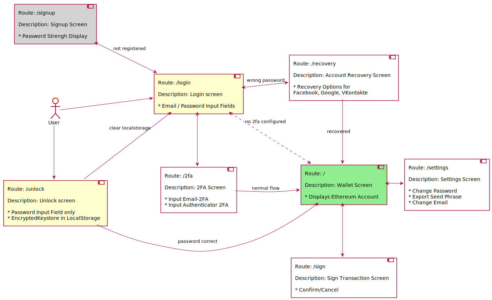

<!--
Created: Thu Dec 03 2020 11:57:15 GMT+0100 (Central European Standard Time)
Modified: Thu Dec 03 2020 11:57:45 GMT+0100 (Central European Standard Time)
-->

# Description of the Routes

 Route        | description           | Meta-Information  | Next Screens Possible |
| ------------- |-------------| -----| ------ |
| Login: /login | The first screen if the LocalStorage is empty | encryptedKeystoreInStorage == false && keystoreUnlocked == false | Signup, Recovery, 2fa, Wallet
| Signup: /signup | If the user wants to create a new Account, then this is the component which takes care of that. | encryptedKeystoreInStorage == false && keystoreUnlocked == false | Login, 2fa |
| Unlock: /unlock | Let's the user unlock the keystore | encryptedKeystoreInStorage == true && keystoreUnlocked == false |
| 2FA: /twoFa | If the user is required to enter 2fa codes, then he is redirected here | mail2fa or authenticator2fa = true | Wallet, Login
| Wallet: / | If the user is logged in correctly, he will see the wallet address and can switch accounts | keystoreUnlocked = true | Login, Settings, Sign
| Settings: /settings | Change Email, Password, Export Seed Phrases, Add Account Recovery | keystoreUnlocked = true | Wallet |
| Sign Transaction: /signtx | Shows a summary of the transaction and a sign/cancel button | keystoreUnlocked = true | Wallet
